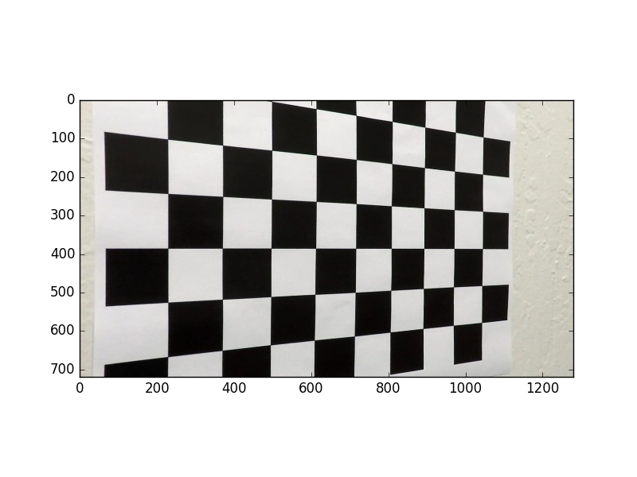
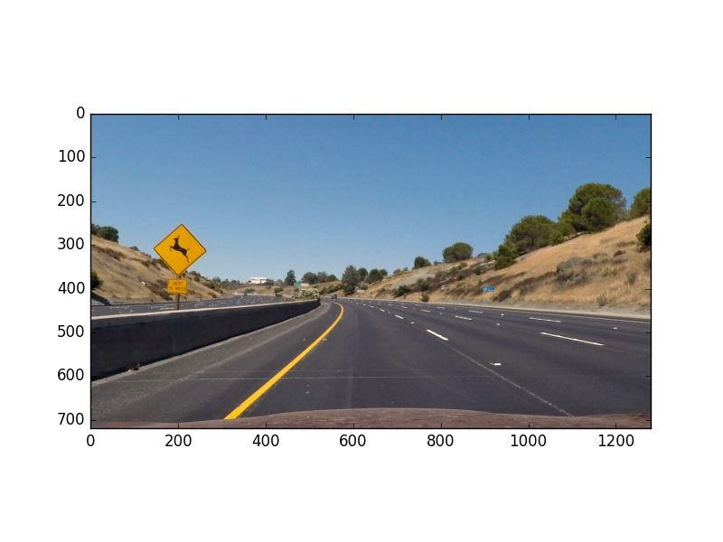
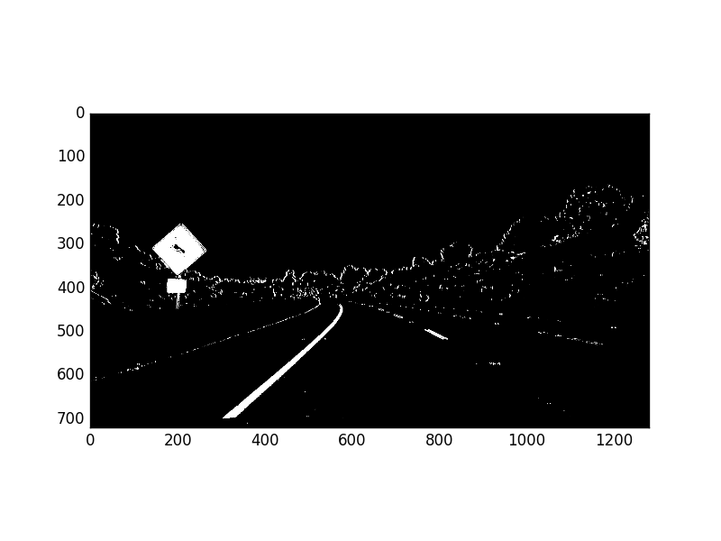
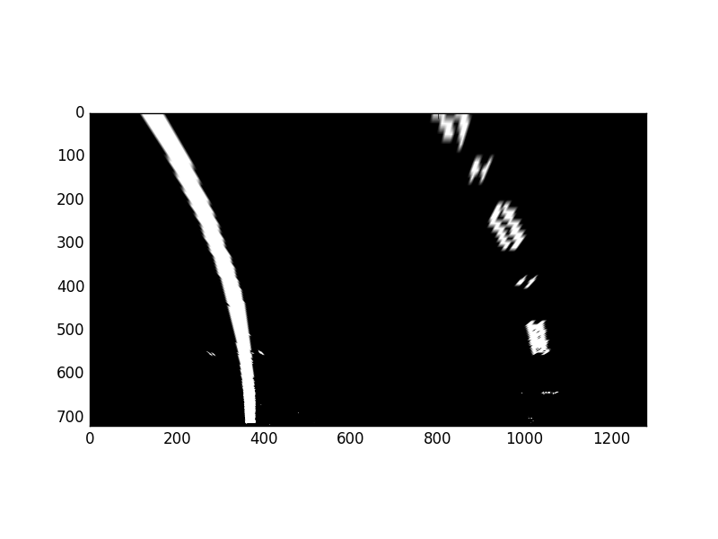
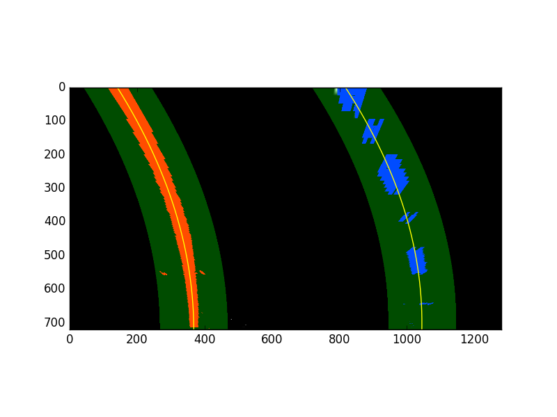

## Lane and Vehicle Detection
**This is not the Repository for the Udacity's Self Driving Car Nanodegree. This is just collection of self sourced Nanodegree projects and resources used are freely available courserwork on Udacity.** 
**Note:** The repository does not contain any training images. You have to download and unzip the image datasets of vehicles and non-vehicles provided by Udacity and place them in appropriate directories on your own. 
Please find all the Challanges, Datasets and other Open Sourced Stuffs by Udacity on Self Driving Car [here](https://github.com/udacity/self-driving-car) 

### Overview
Detect lanes and Vehicles using computer vision and Deep Learning techniques. This project is based on the format and open sourced codes from [Udacity Self-Driving Car Nanodegree](https://www.udacity.com/drive), and much of the code is leveraged from the provided Jupyter Notebooks.
### Dependencies

    - Numpy
    - cv2
    - Matplotlib
    - Pickle
    

**The following steps were performed for lane detection:**

   - Compute the camera calibration matrix and distortion coefficients with a given set of chessboard images.
   - Apply a distortion correction to raw images.
   - Use color transforms, gradients to create a thresholded binary image.
   - Apply a perspective transform to rectify binary image ("birds-eye view").
   - Detect lane pixels and fit to find the lane boundary.
   - Determine the curvature of the lane and vehicle position with respect to center.
   - Warp the detected lane boundaries back onto the original image.
   - Output visual display of the lane boundaries and numerical estimation of lane curvature and vehicle position.

**Following Steps are taken for Vehicle Detection**

- Perform a Histogram of Oriented Gradients (HOG) feature extraction on a labeled training set of images and train a Linear SVM classifier
- Optionally, you can also apply a color transform and append binned color features, as well as histograms of color, to your HOG feature vector. 
- Note: for those first two steps don't forget to normalize your features and randomize a selection for training and testing.
- Implement a sliding-window technique and use your trained classifier to search for vehicles in images.
- Run your pipeline on a video stream (start with the test_video.mp4 and later implement on full project_video.mp4) and create a heat map of recurring detections frame by frame to reject outliers and follow detected vehicles.
- Estimate a bounding box for vehicles detected.

[//]: # (Image References)
[image1]: ./output_images/01_random_data_grid.png
[image2]: ./output_images/02_hog_visualization.png
[image3]: ./output_images/03_detections.png
[image4]: ./output_images/04_boxes_1.png
[image5]: ./output_images/05_boxes_2.png
[image6]: ./output_images/06_boxes_3.png
[image6a]: ./output_images/06a_boxes_4.png
[image7]: ./output_images/07_all_detections.png
[image8]: ./output_images/08_heatmap.png
[image9]: ./output_images/09_heatmap_threshold.png
[image10]: ./output_images/10_label_heatmap.png
[image11]: ./output_images/11_final_boxes.png
[image12]: ./output_images/12_all_test_detects.png
[video1]: ./test_video_out.mp4
[video2]: ./test_video_out_2.mp4
[video3]: ./project_video_out.mp4

### I have considered Udacity's freely available instructions available as [Rubric Points](https://review.udacity.com/#!/rubrics/513/view) for writeup. As it gives fairly great idea to explain project.
---

## How to run
Run `python lanedetect.py`. This will take the raw video file at 'project_video.mp4', and create an annotated output video at 'out.mp4'. Afterwards, it will display an example annotated image on screen.

To run the lane detection script for any video files, update the last few lines of 'lanedetect.py'.

## Camera calibration
Real cameras use curved lenses to form an image, and light rays often bend a little too much or too little at the edges of these lenses. This creates an effect that distorts the edges of images, so that lines or objects appear more or less curved than they actually are. This is called radial distortion, which is the most common type of distortion. 

There are three coefficients needed to correct radial distortion: k1, k2, and k3. To correct the appearance of radially distorted points in an image, one can use a correction formula mentioned below. 
The camera was calibrated using the chessboard images in `camera_calibration/*.jpg`. The following steps were performed for each calibration image:

* Convert to grayscale
* Find chessboard corners with OpenCV's `findChessboardCorners()` function, assuming a 9x6 board

After the above steps were executed for all calibration images, I used OpenCV's `calibrateCamera()` function to calculate the distortion matrices. Using the distortion matrices, I undistort images using OpenCV's `undistort()` function.

To illustrate, the following is the calibration image 'camera_cal/calibration5.jpg':

Here is the same image undistored via camera calibration:

The final calibration matrices are saved in the pickle file 'calibrate_camera.p'

## Lane detection pipeline
The following describes and illustrates the steps involved in the lane detection pipeline. For illustration, below is the original image we will use as an example:

### Undistort image
Using the camera calibration matrices in 'calibrate_camera.p', I undistort the input image. Below is the example image above, undistorted:

The code to perform camera calibration is in 'calibrate_camera.py'. For all images in 'test_images/\*.jpg', the undistorted version of that image is saved in 'output_images/undistort_\*.png'.

### Thresholded binary image
The next step is to create a thresholded binary image, taking the undistorted image as input. The goal is to identify pixels that are likely to be part of the lane lines. In particular, I perform the following:

* Apply the following filters with thresholding, to create separate "binary images" corresponding to each individual filter
  * Absolute horizontal Sobel operator on the image
  * Sobel operator in both horizontal and vertical directions and calculate its magnitude
  * Sobel operator to calculate the direction of the gradient
  * Convert the image from RGB space to HLS space, and threshold the S channel
* Combine the above binary images to create the final binary image

Here is the example image, transformed into a binary image by combining the above thresholded binary filters:

The code to generate the thresholded binary image is in 'combined_thresh.py', in particular the function `combined_thresh()`. For all images in 'test_images/\*.jpg', the thresholded binary version of that image is saved in 'output_images/binary_\*.png'.

### Perspective transform
Given the thresholded binary image, the next step is to perform a perspective transform. The goal is to transform the image such that we get a "bird's eye view" of the lane, which enables us to fit a curved line to the lane lines (e.g. polynomial fit). Another thing this accomplishes is to "crop" an area of the original image that is most likely to have the lane line pixels.

To accomplish the perspective transform, I use OpenCV's `getPerspectiveTransform()` and `warpPerspective()` functions. I hard-code the source and destination points for the perspective transform. The source and destination points were visually determined by manual inspection, although an important enhancement would be to algorithmically determine these points.

Here is the example image, after applying perspective transform:

The code to perform perspective transform is in 'perspective_transform.py', in particular the function `perspective_transform()`. For all images in 'test_images/\*.jpg', the warped version of that image (i.e. post-perspective-transform) is saved in 'output_images/warped_\*.png'.

### Polynomial fit
Given the warped binary image from the previous step, I now fit a 2nd order polynomial to both left and right lane lines. In particular, I perform the following:

* Calculate a histogram of the bottom half of the image
* Partition the image into 9 horizontal slices
* Starting from the bottom slice, enclose a 200 pixel wide window around the left peak and right peak of the histogram (split the histogram in half vertically)
* Go up the horizontal window slices to find pixels that are likely to be part of the left and right lanes, recentering the sliding windows opportunistically
* Given 2 groups of pixels (left and right lane line candidate pixels), fit a 2nd order polynomial to each group, which represents the estimated left and right lane lines

The code to perform the above is in the `line_fit()` function of 'line_fit.py'.

Since our goal is to find lane lines from a video stream, we can take advantage of the temporal correlation between video frames.

Given the polynomial fit calculated from the previous video frame, one performance enhancement I implemented is to search +/- 100 pixels horizontally from the previously predicted lane lines. Then we simply perform a 2nd order polynomial fit to those pixels found from our quick search. In case we don't find enough pixels, we can return an error (e.g. `return None`), and the function's caller would ignore the current frame (i.e. keep the lane lines the same) and be sure to perform a full search on the next frame. Overall, this will improve the speed of the lane detector, useful if we were to use this detector in a production self-driving car. The code to perform an abbreviated search is in the `tune_fit()` function of 'line_fit.py'.

Another enhancement to exploit the temporal correlation is to smooth-out the polynomial fit parameters. The benefit to doing so would be to make the detector more robust to noisy input. I used a simple moving average of the polynomial coefficients (3 values per lane line) for the most recent 5 video frames. The code to perform this smoothing is in the function `add_fit()` of the class `Line` in the file 'Line.py'. The `Line` class was used as a helper for this smoothing function specifically, and `Line` instances are global objects in 'line_fit.py'.

Below is an illustration of the output of the polynomial fit, for our original example image. For all images in 'test_images/\*.jpg', the polynomial-fit-annotated version of that image is saved in 'output_images/polyfit_\*.png'.

### Radius of curvature
Given the polynomial fit for the left and right lane lines, I calculated the radius of curvature for each line according to formulas presented [here](http://www.intmath.com/applications-differentiation/8-radius-curvature.php). I also converted the distance units from pixels to meters, assuming 30 meters per 720 pixels in the vertical direction, and 3.7 meters per 700 pixels in the horizontal direction.

Finally, I averaged the radius of curvature for the left and right lane lines, and reported this value in the final video's annotation.

The code to calculate the radius of curvature is in the function `calc_curve()` in 'line_fit.py'.

### Vehicle offset from lane center
Given the polynomial fit for the left and right lane lines, I calculated the vehicle's offset from the lane center. The vehicle's offset from the center is annotated in the final video. I made the same assumptions as before when converting from pixels to meters.

To calculate the vehicle's offset from the center of the lane line, I assumed the vehicle's center is the center of the image. I calculated the lane's center as the mean x value of the bottom x value of the left lane line, and bottom x value of the right lane line. The offset is simply the vehicle's center x value (i.e. center x value of the image) minus the lane's center x value.

The code to calculate the vehicle's lane offset is in the function `calc_vehicle_offset()` in 'line_fit.py'.

### Annotate original image with lane area
Given all the above, we can annotate the original image with the lane area, and information about the lane curvature and vehicle offset. Below are the steps to do so:

* Create a blank image, and draw our polyfit lines (estimated left and right lane lines)
* Fill the area between the lines (with green color)
* Use the inverse warp matrix calculated from the perspective transform, to "unwarp" the above such that it is aligned with the original image's perspective
* Overlay the above annotation on the original image
* Add text to the original image to display lane curvature and vehicle offset

The code to perform the above is in the function `final_viz()` in 'line_fit.py'.

Below is the final annotated version of our original image. For all images in 'test_images/\*.jpg', the final annotated version of that image is saved in 'output_images/annotated_\*.png'.

---

### Vehicle Detection Pipeline

#### View [here](https://github.com/akhilesh-k/Lane-and-Vehicles-Detection/blob/master/writeup_template.md) the template writeup provided by Udacity.

Well Documented codes are avilable in Jupyter Notebook file [`vehicle_detect.ipynb`](https://github.com/akhilesh-k/Lane-and-Vehicles-Detection/blob/master/vehicle-detect.ipynb) 

---

### Histogram of Oriented Gradients (HOG)

I began by loading all of the vehicle and non-vehicle image paths from the provided dataset. The figure below shows a random sample of images from both classes of the dataset.

![alt text][image1]

The code for extracting HOG features from an image is defined by the method `get_hog_features` and is contained in the cell titled "Define Method to Convert Image to Histogram of Oriented Gradients (HOG)."  The figure below shows a comparison of a car image and its associated histogram of oriented gradients, as well as the same for a non-car image.

![alt text][image2]

The method `extract_features` in the section titled "Method to Extract HOG Features from an Array of Car and Non-Car Images" accepts a list of image paths and HOG parameters (as well as one of a variety of destination color spaces, to which the input image is converted), and produces a flattened array of HOG features for each image in the list.

Next, in the section titled "Extract Features for Input Datasets and Combine, Define Labels Vector, Shuffle and Split," I define parameters for HOG feature extraction and extract features for the entire dataset. These feature sets are combined and a label vector is defined (`1` for cars, `0` for non-cars). The features and labels are then shuffled and split into training and test sets in preparation to be fed to a linear support vector machine (SVM) classifier. The table below documents the twenty-five different parameter combinations that I explored.

| Configuration Label | Colorspace | Orientations | Pixels Per Cell | Cells Per Block | HOG Channel | Extract Time |
| :-----------------: | :--------: | :----------: | :-------------: | :-------------: | :---------: | ------------:|
| 1                   | RGB        | 9            | 8               | 2               | ALL         | 71.16        |
| 2                   | HSV        | 9            | 8               | 2               | 1           | 43.74        |
| 3                   | HSV        | 9            | 8               | 2               | 2           | 36.35        |
| 4                   | LUV        | 9            | 8               | 2               | 0           | 37.42        |
| 5                   | LUV        | 9            | 8               | 2               | 1           | 38.34        |
| 6                   | HLS        | 9            | 8               | 2               | 0           | 37.42        |
| 7                   | HLS        | 9            | 8               | 2               | 1           | 42.04        |
| 8                   | YUV        | 9            | 8               | 2               | 0           | 35.86        |
| 9                   | YCrCb      | 9            | 8               | 2               | 1           | 38.32        |
| 10                  | YCrCb      | 9            | 8               | 2               | 2           | 38.99        |
| 11                  | HSV        | 9            | 8               | 2               | ALL         | 79.72        |
| 12                  | LUV        | 9            | 8               | 2               | ALL         | 78.57        |
| 13                  | HLS        | 9            | 8               | 2               | ALL         | 81.37        |
| 14                  | YUV        | 9            | 8               | 2               | ALL         | 81.82        |
| 15                  | YCrCb      | 9            | 8               | 2               | ALL         | 79.05        |
| 16                  | YUV        | 9            | 8               | 1               | 0           | 44.04        |
| 17                  | YUV        | 9            | 8               | 3               | 0           | 37.74        |
| 18                  | YUV        | 6            | 8               | 2               | 0           | 37.12        |
| 19                  | YUV        | 12           | 8               | 2               | 0           | 40.11        |
| 20                  | YUV        | 11           | 8               | 2               | 0           | 38.01        |
| 21                  | YUV        | 11           | 16              | 2               | 0           | 30.21        |
| 22                  | YUV        | 11           | 12              | 2               | 0           | 30.33        |
| 23                  | YUV        | 11           | 4               | 2               | 0           | 69.08        |
| 24                  | YUV        | 11           | 16              | 2               | ALL         | 55.20        |
| 25                  | YUV        | 7            | 16              | 2               | ALL         | 53.18        |

#### 2. Explain how you settled on your final choice of HOG parameters.

I settled on my final choice of HOG parameters based upon the performance of the SVM classifier produced using them. I considered not only the accuracy with which the classifier made predictions on the test dataset, but also the speed at which the classifier is able to make predictions. There is a balance to be struck between accuracy and speed of the classifier, and my strategy was to bias toward speed first, and achieve as close to real-time predictions as possible, and then pursue accuracy if the detection pipeline were not to perform satisfactorily.  

The final parameters chosen were those labeled "configuration 24" in the table above: YUV colorspace, 11 orientations, 16 pixels per cell, 2 cells per block, and `ALL` channels of the colorspace. The classifier performance of each of the configurations from the table above are summarized in the table below:

| Configuration (above) | Classifier | Accuracy | Train Time |
| :-------------------: | :--------: | -------: | ---------: |
| 1                     | Linear SVC | 97.52    | 19.21      |
| 2                     | Linear SVC | 91.92    | 5.53       |
| 3                     | Linear SVC | 96.09    | 4.29       |
| 4                     | Linear SVC | 95.72    | 4.33       |
| 5                     | Linear SVC | 94.51    | 4.51       |
| 6                     | Linear SVC | 92.34    | 4.97       |
| 7                     | Linear SVC | 95.81    | 4.04       |
| 8                     | Linear SVC | 96.28    | 5.04       |
| 9                     | Linear SVC | 94.88    | 4.69       |
| 10                    | Linear SVC | 93.78    | 4.59       |
| 11                    | Linear SVC | 98.31    | 16.03      |
| 12                    | Linear SVC | 97.52    | 14.77      |
| 13                    | Linear SVC | 98.42    | 13.46      |
| 14                    | Linear SVC | 98.40    | 15.68      |
| 15                    | Linear SVC | 98.06    | 12.86      |
| 16                    | Linear SVC | 94.76    | 5.11       |
| 17                    | Linear SVC | 96.11    | 6.71       |
| 18                    | Linear SVC | 95.81    | 3.79       |
| 19                    | Linear SVC | 95.95    | 4.84       |
| 20                    | Linear SVC | 96.59    | 5.46       |
| 21                    | Linear SVC | 95.16    | 0.52       |
| 22                    | Linear SVC | 94.85    | 1.27       |
| 23                    | Linear SVC | 95.92    | 21.39      |
| 24                    | Linear SVC | 98.17    | 1.14       |
| 25                    | Linear SVC | 97.61    | 1.42       |

*Note: I neglected to record the time to make predictions, but I consider the classifier training time to be a reasonable proxy.*

#### 3. Describe how (and identify where in your code) you trained a classifier using your selected HOG features (and color features if you used them).

In the section titled "Train a Classifier" I trained a linear SVM with the default classifier parameters and using HOG features alone (I did not use spatial intensity or channel intensity histogram features) and was able to achieve a test accuracy of 98.17%. 

---

### Sliding Window Search

#### 1. Describe how (and identify where in your code) you implemented a sliding window search.  How did you decide what scales to search and how much to overlap windows?

In the section titled "Method for Using Classifier to Detect Cars in an Image" I adapted the method `find_cars` from the lesson materials. The method combines HOG feature extraction with a sliding window search, but rather than perform feature extraction on each window individually which can be time consuming, the HOG features are extracted for the entire image (or a selected portion of it) and then these full-image features are subsampled according to the size of the window and then fed to the classifier. The method performs the classifier prediction on the HOG features for each window region and returns a list of rectangle objects corresponding to the windows that generated a positive ("car") prediction.

The image below shows the first attempt at using `find_cars` on one of the test images, using a single window size:

![alt text][image3]

I explored several configurations of window sizes and positions, with various overlaps in the X and Y directions. The following four images show the configurations of all search windows in the final implementation, for small (1x), medium (1.5x, 2x), and large (3x) windows:

![alt text][image4]
![alt text][image5]
![alt text][image6]
![alt text][image6a]

The final algorithm calls `find_cars` for each window scale and the rectangles returned from each method call are aggregated. In previous implementations smaller (0.5) scales were explored but found to return too many false positives, and originally the window overlap was set to 50% in both X and Y directions, but an overlap of 75% in the Y direction (yet still 50% in the X direction) produced more redundant true positive detections, which were preferable given the heatmap strategy described below. Additionally, only an appropriate vertical range of the image is considered for each window size (e.g. smaller range for smaller scales) to reduce the chance for false positives in areas where cars at that scale are unlikely to appear. The final implementation considers 190 window locations, which proved to be robust enough to reliably detect vehicles while maintaining a high speed of execution.

The image below shows the rectangles returned by `find_cars` drawn onto one of the test images in the final implementation. Notice that there are several positive predictions on each of the near-field cars, and one positive prediction on a car in the oncoming lane.

![alt text][image7]

Because a true positive is typically accompanied by several positive detections, while false positives are typically accompanied by only one or two detections, a combined heatmap and threshold is used to differentiate the two. The `add_heat` function increments the pixel value (referred to as "heat") of an all-black image the size of the original image at the location of each detection rectangle. Areas encompassed by more overlapping rectangles are assigned higher levels of heat. The following image is the resulting heatmap from the detections in the image above:

![alt text][image8]

A threshold is applied to the heatmap (in this example, with a value of 1), setting all pixels that don't exceed the threshold to zero. The result is below:

![alt text][image9]

The `scipy.ndimage.measurements.label()` function collects spatially contiguous areas of the heatmap and assigns each a label:

![alt text][image10]

And the final detection area is set to the extremities of each identified label:

![alt text][image11]

#### 2. Show some examples of test images to demonstrate how your pipeline is working.  What did you do to optimize the performance of your classifier?

The results of passing all of the project test images through the above pipeline are displayed in the images below:

![alt text][image12]

The final implementation performs very well, identifying the near-field vehicles in each of the images with no false positives. 

The first implementation did not perform as well, so I began by optimizing the SVM classifier. The original classifier used HOG features from the YUV Y channel only, and achieved a test accuracy of 96.28%. Using all three YUV channels increased the accuracy to 98.40%, but also tripled the execution time. However, changing the `pixels_per_cell` parameter from 8 to 16 produced a roughly ten-fold increase in execution speed with minimal cost to accuracy. 

Other optimization techniques included changes to window sizing and overlap as described above, and lowering the heatmap threshold to improve accuracy of the detection (higher threshold values tended to underestimate the size of the vehicle).

---

### Video Implementation

#### 1. Provide a link to your final video output.  Your pipeline should perform reasonably well on the entire project video (somewhat wobbly or unstable bounding boxes are ok as long as you are identifying the vehicles most of the time with minimal false positives.)

Here's a [link to my video result][video3]

#### 2. Describe how (and identify where in your code) you implemented some kind of filter for false positives and some method for combining overlapping bounding boxes.

The code for processing frames of video is contained in the cell titled "Pipeline for Processing Video Frames" and is identical to the code for processing a single image described above, with the exception of storing the detections (returned by `find_cars`) from the previous 15 frames of video using the `prev_rects` parameter from a class called `Vehicle_Detect`. Rather than performing the heatmap/threshold/label steps for the current frame's detections, the detections for the past 15 frames are combined and added to the heatmap and the threshold for the heatmap is set to `1 + len(det.prev_rects)//2` (one more than half the number of rectangle sets contained in the history) - this value was found to perform best empirically (rather than using a single scalar, or the full number of rectangle sets in the history).

<!--#### 1. Briefly discuss any problems / issues you faced in your implementation of this project.  Where will your pipeline likely fail?  What could you do to make it more robust?
The problems that I faced while implementing this project were mainly concerned with detection accuracy. Balancing the accuracy of the classifier with execution speed was crucial. Scanning 190 windows using a classifier that achieves 98% accuracy should result in around 4 misidentified windows per frame. Of course, integrating detections from previous frames mitigates the effect of the misclassifications, but it also introduces another problem: vehicles that significantly change position from one frame to the next (e.g. oncoming traffic) will tend to escape being labeled. Producing a very high accuracy classifier and maximizing window overlap might improve the per-frame accuracy to the point that integrating detections from previous frames is unnecessary (and oncoming traffic is correctly labeled), but it would also be far from real-time without massive processing power.  
The pipeline is probably most likely to fail in cases where vehicles (or the HOG features thereof) don't resemble those in the training dataset, but lighting and environmental conditions might also play a role (e.g. a white car against a white background). As stated above, oncoming cars are an issue, as well as distant cars (as mentioned earlier, smaller window scales tended to produce more false positives, but they also did not often correctly label the smaller, distant cars). 
I believe that the best approach, given plenty of time to pursue it, would be to combine a very high accuracy classifier with high overlap in the search windows. The execution cost could be offset with more intelligent tracking strategies, such as:
- determine vehicle location and speed to predict its location in subsequent frames
- begin with expected vehicle locations and nearest (largest scale) search areas, and preclude overlap and redundant detections from smaller scale search areas to speed up execution 
- use a convolutional neural network, to preclude the sliding window search altogether
-->
